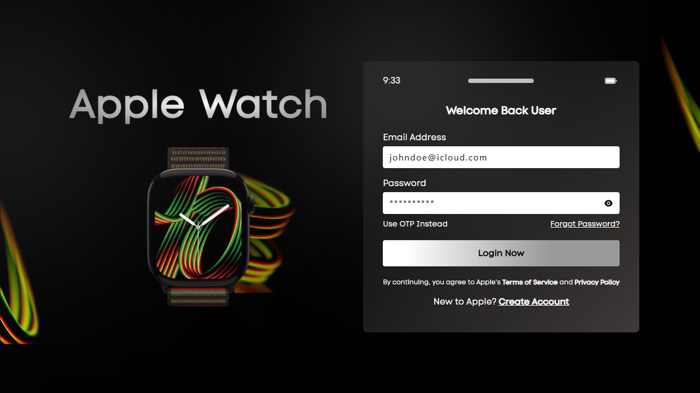
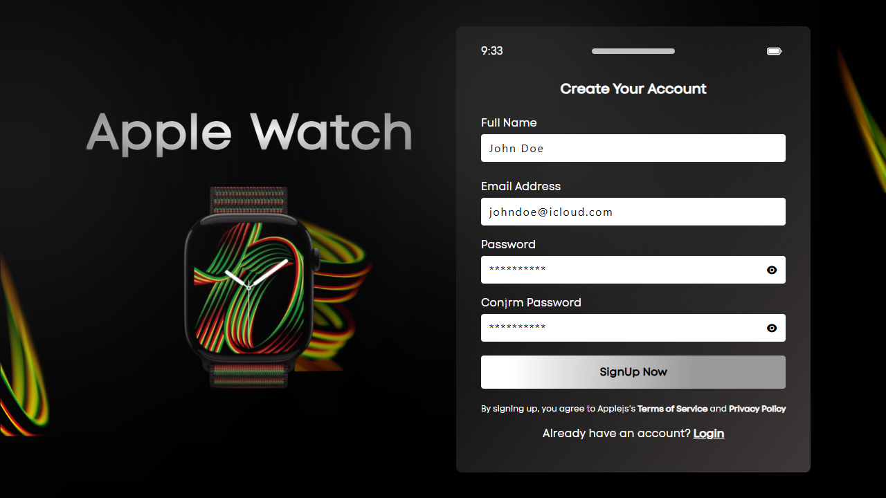

# AppleWatchLoginPage

Fully Responsive Login/Signup Page for a Company Like Apple Watch

## Description

This project is a fully responsive login and signup page inspired by Apple’s sleek design style. It uses modern web technologies such as **HTML**, **CSS**, and **Tailwind CSS** to create a clean, elegant, and user-friendly interface that adapts perfectly across devices.

## Features

- 📱 Fully responsive design (desktop, tablet, mobile)
- 🎨 Modern Apple-inspired UI with gradients and background blur effects
- 🔑 Login and Signup forms
- 👁️ Password visibility toggle with eye icon
- 🖼️ Branding section with Apple Watch images
- 📋 Terms & Conditions and Privacy Policy section
- 🔗 Easy navigation between **Login** and **Signup** pages

## Technologies Used

- **HTML**
- **CSS**
- **Tailwind CSS**
- **Remix Icon**

## Usage

1. Clone the repository  
   ```bash
   git clone https://github.com/diwasatreya/AppleWatchLogin.git
    ```
2. Open `index.html` for the login page
3. Open `signup.html` for the signup page

## Preview

Login Page:


Signup Page:


## License

This project is licensed under the Apache License 2.0. See the [LICENSE](LICENSE) file for details.

## Support
Free free to ⭐ fork/start or to contribute on the repository and make sure to follow [Diwas Atreya](https://github.com/diwasatreya)